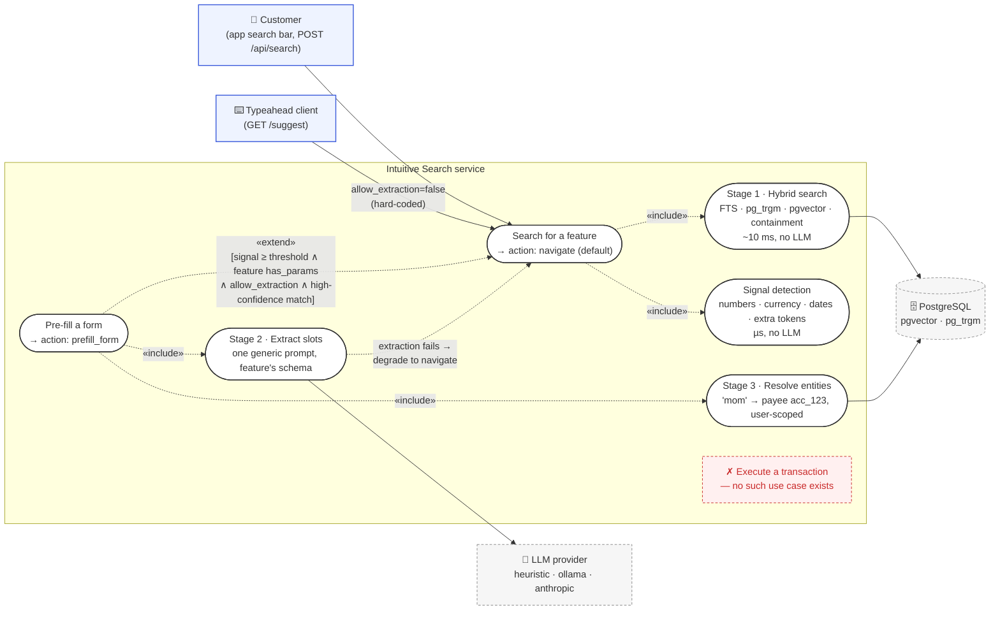

# Slide 1 — Title

**Intuitive Search**
Finding features the way customers actually ask for them.

Speaker note: one-line framing — "a search bar that understands *trf*, *download e-statement*, and *transfer to mom's 10000 usd* — and knows the difference between the first two and the third."

---

# Slide 2 — The problem we're solving

Two things break in a 60+ feature banking app:

- **Discovery.** Users know *what* they want, not *where it lives* in our IA. Menus punish long tails: "e-stmt", "block card", "where did my money go".
- **Friction.** Even when they find the screen, they still have to fill it in. A power-user request like "transfer to mom's 10000 usd" travels through 4 taps and 3 fields before it's a form they can confirm.

We treat search as the shortest path from **intent → confirmable form**, without ever executing on the customer's behalf.

Speaker note: this framing lands the safety point up front — nothing here can move money. That is the single most important thing for compliance-minded stakeholders.

---

# Slide 3 — What it does, in one screen

| Query | What happens | LLM fired? | Latency |
|---|---|---|---|
| `trf` | Opens Transfer | no | 13 ms |
| `e-stmt` | Opens Download e-Statement | no | 10 ms |
| `where did my money go` | Opens Spending Insights | no | 15 ms |
| `block my card` | Opens Block Card | no | 10 ms |
| `transfer to mom's 10000 usd` | **Pre-fills Transfer form** (recipient=Mom, amount=10000, USD) | yes | 18 ms |
| `send 250 usd to landlord` | **Pre-fills Transfer form** | yes | 8 ms |
| `download e-statement for march` | **Pre-fills e-Statement form** (period=March) | yes | 12 ms |

Measured against the running stack, 67 seeded features.

Speaker note: this slide *is* the demo. The nuance is in the last column — LLM only where it has to. Everything else is deterministic, fast, and cheap.

---

# Slide 4 — How it works, and why in that shape



Reading the diagram: solid arrows are actors using the system (or the system using an external system). `«include»` is always-on behaviour; `«extend»` is optional behaviour that only fires when the guard in brackets holds — that guard is the LLM gate. The crossed-out use case is there deliberately: it is the one thing the service cannot be asked to do.

Three properties we designed for:

1. **Cheapest thing that could work.** The 80% case — "take me to a screen" — never touches the LLM. It's Postgres.
2. **LLM only when the query genuinely carries parameters.** Four independent gates must all open. Typeahead physically cannot reach it.
3. **Nothing the model returns is trusted.** The parser drops unknown keys, coerces types, and if extraction fails the answer degrades to plain navigation — never a wrong pre-fill.

**The strongest action this service can return is `prefill_form`.** There is no execute path anywhere in the codebase.

Speaker note: the four-value action enum (`navigate` · `prefill_form` · `suggest` · `none`) is the compliance boundary, in code. Grep-provable. Degrading is a first-class outcome, not an error path — everything works or falls back to something that works.

---

# Slide 5 — The economics of the LLM gate

If we called the LLM on every keystroke, at typeahead volumes we'd spend most of the search bar's budget on requests that were never going to need it.

The gate is what stops that. Concretely, on the seeded workload:

- `trf`, `tran`, `transfer`, `send money`, `i want to send money please` → **all score below threshold**. Navigation only.
- `transfer to mom's 10000 usd` → **scores 4**. Extraction runs.

Signal detection is regex + a token list. It costs microseconds. It is the difference between a search that scales with query volume and one that scales with **LLM spend**.

`GET /suggest` (used by typeahead) **hard-codes `allow_extraction=false`.** A client-side bug cannot open the LLM gate.

Speaker note: this is the answer to "won't this get expensive at scale?" — no, because 80–90% of queries never leave Postgres, and the safety is in the code, not in an operational rule someone might forget.

---

# Slide 6 — Adding a feature is one INSERT

```sql
INSERT INTO features (feature_id, display_name, description, category, route,
                      keywords, aliases, has_params, slots)
VALUES ('request_cheque_book', 'Request Cheque Book', ...,
        ARRAY['cheque','check book','chequebook'], ARRAY['chq','cheque'],
        TRUE,
        '[{"name":"account","type":"string","resolver":"account"}, ...]'::jsonb);
```

Then embed it. Cache picks it up within 60 seconds. No deploy, no release, no code review of a feature module.

- **67 features** ship today.
- The originally-scoped constraint was "feature #51 requires no code changes". We are past that.
- The **only** thing that ever needs new engineering time is a new *resolver kind* (currently 8 cover the shapes a banking form actually has).

Speaker note: this is the slide for the BA. "When product adds a new capability, how does it get into search?" — a row, not a ticket. The admin dashboard (Slide 9) is the UI for this.

---

# Slide 7 — Performance, measured not claimed

Budgets: **<100 ms navigation · <400 ms command extraction.**

Load tested against the running stack (10,000 requests):

| | before hardening | after |
|---|---|---|
| `/api/search`, c=32 | 56 rps · p50 565 ms | **637 rps · p50 24 ms** |
| `/api/search`, c=128 | 56 rps · p50 2,243 ms | **798 rps · p50 133 ms** |
| `/api/search`, c=512 | 56 rps · p50 9,020 ms | **851 rps · p50 535 ms** |
| 10,000 simultaneous, one each | — | **10,000/10,000 OK, 1,001 rps, p50 2.0 s** |

Two lessons worth naming because they generalise:

- **A read timeout does not bound a queue.** Our client had a 400 ms read timeout that never fired while p50 sat at 9 seconds. Fixed with a deadline over the *whole* call, a bulkhead, and a circuit breaker.
- **One CPU-bound worker gets *slower* under concurrency.** Throughput fell going from 8 to 32 clients — torch intra-op threads contending. Fixed with `OMP_NUM_THREADS=1` and 4 processes.

Speaker note: we didn't guess; we measured; the fixes name failure modes, not vibes. Appendix C has the two ranking bugs we only found by running the pipeline — same lesson. Appendix D covers why the embedding service isn't just another Ollama.

---

# Slide 8 — Provider flexibility, not vendor lock

Stage 2 is one config knob:

| Provider | Use for | Notes |
|---|---|---|
| `heuristic` (default) | dev, CI | No model, no network. Regex + slot metadata. Everything runs offline. |
| `ollama` | on-prem / air-gapped | `qwen2.5:3b-instruct` or `phi-3-mini`. Slot schema constrains decoding to conforming JSON. |
| `anthropic` | hosted | Claude Haiku. Extraction as a **tool call** whose schema is the feature's slots, so output is structured, not prose. |

Same prompt template, same JSON schema, same defensive parser across all three. Swapping providers is not a project.

Stage 1 query embeddings stay on sentence-transformers regardless of this choice — a different workload with different constraints (Appendix D).

The compliance implication is deliberate: **`ollama` exists as a first-class option, not an afterthought.** If legal asks "does user-typed text leave our network in Stage 2?", the honest answer with `anthropic` is yes, with `ollama` is no, and switching is a config change — not a rewrite.

Speaker note: for the VP, this is the "we haven't painted ourselves into a corner" slide. Vendor decisions are reversible; the architecture is not tied to a specific model or hosting story.

---

# Slide 9 — The admin dashboard

The registry needs to be edited by humans who are not backend engineers. The dashboard is the surface for that:

- Full CRUD over the features table, with a structured slot editor
- **Stale-vector detection.** Editing feature text does not silently drop its vector; the row is marked stale via a source-hash column and one button re-embeds it
- **Search playground.** Run a query against the live API, read the whole diagnostics block (per-channel scores, signal score, whether the LLM fired, per-stage timings)
- **Analytics** — LLM invocation rate, latency percentiles by path, top queries, and the *unresolved* queries (the registry's real to-do list)
- Change log of every write

Adding a *new managed table* is one config object, not a feature branch. That property mirrors the search service itself.

Speaker note: this is where the BA and product team live day to day. "Which of our queries don't resolve?" is a business question with a UI answer, weekly.

---

# Slide 10 — What ships next, and the one decision we need

**Pre-launch checklist** (all named, none surprising):

- Principal from JWT, not the request body — Stage 3 queries are user-scoped, this is a hard requirement
- CORS pinned, endpoints behind the existing gateway
- `search_audit` writes wired into the backend (one `@Async` component; response already carries every field)

**Roadmap after pilot** (in payback order):

1. Feed unresolved queries from the dashboard to product weekly as concrete "we should add this" signal
2. Micro-batching in the embedding service — ~2× throughput per core when scale calls for it
3. Revisit HNSW sizing only if the registry grows by orders of magnitude

**One decision to make in this room:**

> **Which Stage-2 provider does the pilot ship with — `ollama` (on-prem, nothing leaves the network) or `anthropic` (hosted, faster iteration)?**

Everything else can proceed on its own schedule. This one gates the pre-launch checklist and has stakeholders across compliance, infra, and cost.

Speaker note: end with a single, answerable question. Do not leave the room without it.

---

# Appendix A — Response shape (for Q&A)

```json
{
  "matched_feature": "transfer",
  "display_name": "Transfer Money",
  "route": "/payments/transfer",
  "confidence": 0.529,
  "params_extracted": true,
  "slots": {
    "recipient": { "raw": "mom",
                   "resolved_account_id": "acc_123",
                   "resolved_name": "Mom (Jane Doe)",
                   "resolved_detail": "Local Bank ****8899",
                   "match_score": 1.0 },
    "amount": 10000, "currency": "USD"
  },
  "action": "prefill_form",
  "diagnostics": {
    "timings_ms": { "stage1_hybrid_search": 11, "signal_detection": 0,
                    "stage2_llm_extraction": 180, "stage3_entity_resolution": 3 },
    "total_ms": 195, "llm_invoked": true, "llm_provider": "anthropic",
    "signal_score": 4,
    "signals": ["number:10000","currency:usd","extra_tokens:mom"],
    "score_breakdown": { "keyword": 0.17, "trigram": 0.42,
                         "vector": 0.59, "containment": 0.75 }
  }
}
```

# Appendix B — Stack

- Java 21 + Spring Boot 3.2 with virtual threads (chained I/O, blocking style, no reactive plumbing)
- PostgreSQL 16 with `pgvector` and `pg_trgm`
- FastAPI embedding service (`bge-small-en-v1.5`, 384-dim, CPU)
- Kubernetes (local `orb.local`, production TBD), Istio for mesh + observability
- Admin dashboard: Next.js 15 (App Router) + Tailwind, no ORM
- 38 unit tests covering the signal gate, hostile-JSON parsing, tsquery sanitisation, prompt genericity, Stage-3 normalisation, and containment ranking

# Appendix C — Two ranking problems we only found by running it (for Q&A)

Both would have passed a green unit-test suite. Worth having ready if the Tech Lead asks about verification.

**1. Similarity is diluted by the parameter payload.** `transfer to mom's 10000 usd` shares one word with the registry; the rest is payload no feature has ever seen. Every similarity channel drops. The queries that most needed Stage 2 were being gated out of it.

Fix — a **containment channel** (does the query literally contain one of the feature's naming terms? — payload can dilute similarity, it cannot dilute this) plus a **margin-based gate** ("high confidence" really means "clear gap to the runner-up", not "raw score above X").

**2. `ivfflat` silently lost the right answer.** At `lists=8, probes=1`, a query searches one partition. `send 250 usd to landlord` came back with transfer scoring 0.0 on vector while topping every lexical channel — not an error, just a quietly missing candidate. Now HNSW: no training-data requirement, much better default recall at this size.

# Appendix D — Why embeddings don't run on Ollama (for Q&A)

The obvious question after Slide 8: if `ollama` is the on-prem answer for Stage 2, why is Stage 1 a separate Python service running `bge-small-en-v1.5` through sentence-transformers? Four reasons, all about the workload rather than the vendor.

**1. Query and document vectors must come from one runtime.** The registry's vectors were produced offline by sentence-transformers (`precompute_embeddings.py`). Ollama serves through llama.cpp with a quantised GGUF and its own tokenizer, and emits slightly different vectors for the same text. Moving only the query side would drift the two spaces apart; moving both means re-embedding the registry through the new model before any traffic switches. It is a migration, not a config change.

**2. The 400 ms deadline vs idle unload.** Ollama unloads an idle model after five minutes by default. The first query after a lull pays a multi-second reload — which our client's whole-call deadline turns into a circuit-breaker trip. Our service loads the model *before* the port opens, so there is no such first request. (`OLLAMA_KEEP_ALIVE=-1` fixes it, but it is a default that works against an always-on stage.)

**3. Scaling shape.** Slide 7's finding — four single-threaded processes beat one multi-threaded one — is the opposite of Ollama's one-process, N-slots model. Worse, sharing one Ollama between embeddings and Stage 2's 3B extraction model on CPU would queue the *always-on* stage's requests behind the *conditional* stage's generation calls; the p99 of every navigation query would inherit the cost of the rare command query.

**4. The knobs we rely on are thirty lines of Python.** BGE's query-side instruction prefix, unit-normalised output (so pgvector cosine is a plain dot product), the 128-token cap that bounds worst-case latency, and the typeahead prefix cache all live in `app.py`. Under Ollama each of those moves into the Java client.

**When we would switch:** a GPU node, or a mandate to consolidate on one serving layer. Then: a separate Ollama instance for embeddings, keep-alive pinned, prefix added in the Java client, and the registry re-embedded through the same runtime before traffic moves.
